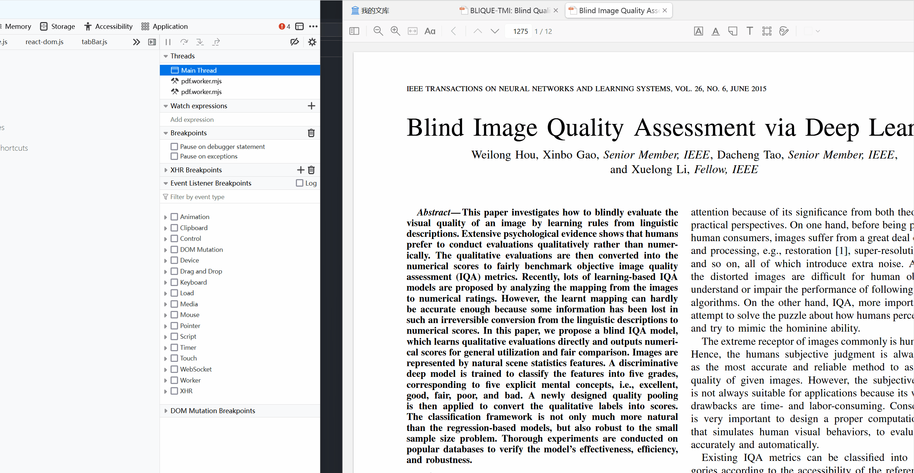
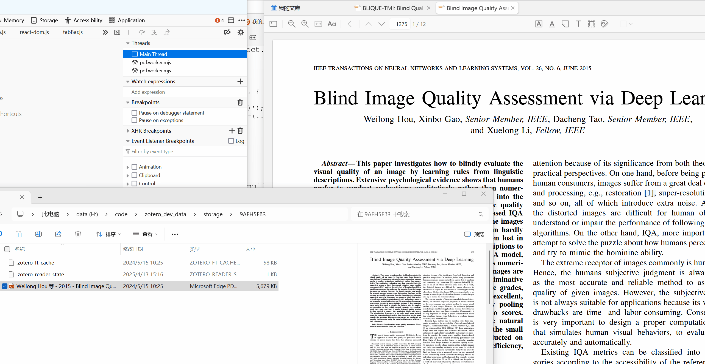

# Tab Enhance for Zotero

Tab Enhance是一个Zotero 7插件，为Zotero的标签页添加了更多便捷功能。

## 主要功能

- **在文件系统中显示**: 右键点击文档标签页，可以快速在文件系统中定位当前文档(避免从Zotero item 再到 文件系统 的两步跳转)
- **重新载入标签页**：右键点击文档标签页，可以重新载入标签页(方便同步外部编辑器对文档的修改)
- _(更多功能开发中...)_

## 安装

1. 从[Releases页面](https://github.com/Rphone/zotero-tab-enhance/releases)下载最新的`.xpi`文件
2. 在Zotero中，选择`工具 -> 插件 -> ⚙️ -> Install Plugin From File`，然后选择下载的XPI文件

## 兼容性

- 需要Zotero 7.0或更高版本
- 兼容Zotero 7.0-7.1.\*

## 功能

### 标签直接跳转文件系统

1. 打开一个PDF或其他文档在Zotero中
2. 右键点击该文档的标签页
3. 选择"Show in Filesystem"选项

   #### 功能截图

### 标签重载

1. 打开一个PDF或其他文档在Zotero中
2. 右键点击该文档的标签页
3. 选择"Reload"选项

   #### 功能截图

   

## 问题反馈

本人非经验丰富的JavaScript和Zotero开发者，因此插件难免会碰到潜在的bug，如有问题或建议，请在[GitHub Issues](https://github.com/Rphone/zotero-tab-enhance/issues)页面提交。

## 许可

该项目基于[AGPLv3](https://www.gnu.org/licenses/agpl-3.0.html)许可发布。
