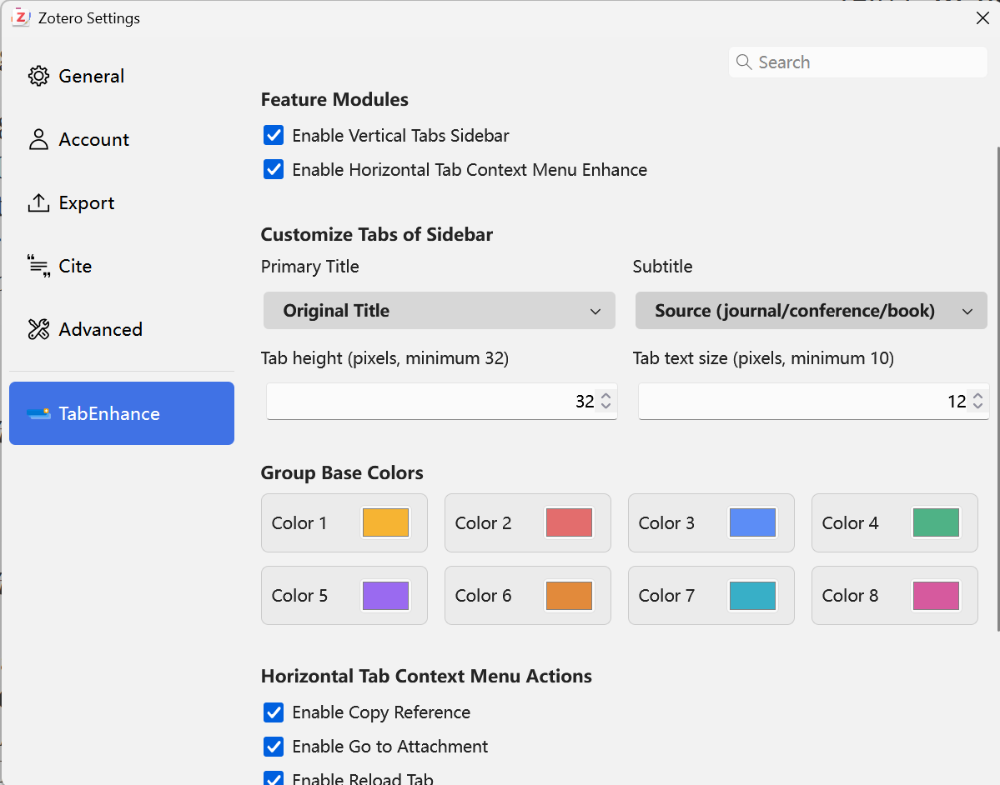

# Tab Enhance for Zotero

[简体中文](../readme.md) | English

Tab Enhance is a Zotero add-on for managing tabs. It provides a searchable, groupable, and sortable vertical tab sidebar, and extends the context menus of native horizontal tabs and library items to help users manage large numbers of reader tabs.

## Feature Overview

- **Vertical tab sidebar**: Synchronizes with Zotero's native tabs and supports search, multiple views, resizing, and quick collapse.
- **Persistent tab groups**: Create, reorder, rename, color, collapse, open, and close groups. Closed group members remain available for later reopening.
- **Drag-and-drop management**: Reorder native tabs, group members, and groups, or move tabs between groups.
- **Horizontal tab context menu**: Show attachments in the file manager, reload readers, copy citations, and create or join groups.
- **Open and group from the item list**: Open the best file attachments of one or more selected items into a new or existing group.

## Installation and Setup

1. Download the latest `.xpi` file from the [Releases page](https://github.com/Rphone/zotero-tab-enhance/releases).
2. In Zotero, open `Tools -> Plugins`.
3. Click the gear button and choose `Install Plugin From File`, then select the downloaded XPI file.
4. Open the `TabEnhance` page in Zotero settings and enable the vertical tab sidebar and horizontal tab enhancements as needed.

> The vertical tab sidebar and horizontal tab enhancements are disabled by default. Group actions in the native horizontal tab menu require the vertical sidebar to be enabled.

## Vertical Tab Sidebar

When enabled, the add-on places a tab sidebar on the left side of Zotero's content area and keeps it synchronized with the current window's native tabs. Click a row to select its tab, or use the close button to close the corresponding native tab.

- Drag the splitter to resize the sidebar.
- Use the button at the left of the header to collapse or expand it.
- Press `Ctrl+B` to toggle the sidebar; use `Cmd+B` on macOS.
- Automatically follows Zotero's light or dark theme.
- Displays the current tab count beside the sidebar title.

### Search and Views

The search field filters by group name, tab title, and tab information. Three views are available:

- **Default**: Shows groups and ungrouped tabs, with all grouping and drag-and-drop operations available.
- **Recent**: Collects open tabs under Just Now, Today, and Earlier sections.
- **Type**: Collects open tabs by Reader, Note, Web, and other tab types.

## Tab Groups

### Creating Groups and Adding Tabs

Groups can be created from several entry points:

- Click `+` in the sidebar header to place all currently open, ungrouped tabs into one new group.
- Right-click a single tab and choose `Create Group` to create a group from that tab.
- Right-click a tab and choose `Add to Group` to add it to an existing group.
- Use `Open and Group` in Zotero's item-list context menu to open selected file attachments into a new or existing group.

Group names can be edited inline. Press `Enter` to confirm or `Esc` to cancel.

### Managing Groups

Right-click a group header to:

- Open all group members.
- Close other tabs and open this group.
- Close every currently open tab in the group.
- Expand or collapse the group.
- Rename the group.
- Choose a group color from the configured palette.
- Dissolve the group without closing tabs that are still open.

Closing a reader tab inside a group does not remove the member from that group. The member remains in a closed state and can be reopened by clicking it, choosing `Load Tab`, or using a group-level open command.

### Drag and Drop

In Default view, drag and drop can be used to:

- Reorder ungrouped tabs and synchronize the order with Zotero's native horizontal tabs.
- Reorder members within a group.
- Drag an ungrouped tab into a group.
- Move a member to another group, or drag an open member back to the ungrouped list.
- Reorder groups.

Group-member context menus also provide `Move to Group`, `Add to Group`, and `Remove from Group`. Adding keeps the member in its original group, while moving removes it from the original group.

## Horizontal Tab Context Menu

After enabling horizontal tab enhancements, right-click a native Zotero reader tab to use the following commands. Each attachment command can be enabled or disabled independently in the add-on settings.

### Show in File Manager

Locate the current reader's local attachment directly, without returning to the library item first.

### Reload Tab

Close and reopen the current reader tab to refresh changes made to a PDF or other attachment by an external editor.

### Copy Citation

Copy a citation for the current item to the clipboard. The output follows Zotero's Quick Copy configuration under `Edit -> Settings -> Export -> Quick Copy`.

### Group Actions

When the vertical sidebar is also enabled, the native horizontal tab menu provides `Create Group` and `Add to Group` commands.

## Open and Group from the Item List

With the vertical sidebar enabled, select one or more items in Zotero's item list and open the `Open and Group` context menu:

1. Choose `Open in New Group` to create a group for all openable file attachments.
2. Or choose an existing group to open the attachments and add them to that group.
3. For multiple selections, the add-on opens each item's best file attachment in the background and avoids opening the same attachment twice.

Items without an available file attachment are skipped.

## Customization

The `TabEnhance` page in Zotero settings provides controls for:

- Enabling the vertical tab sidebar and horizontal tab enhancements.
- Showing or hiding Copy Citation, Show in File Manager, and Reload Tab commands.
- Displaying a full title or short title as the primary label.
- Showing Source, Creator and Year, Type and Item ID, or no subtitle.
- Adjusting tab-row height and text size.
- Configuring eight base group colors. New groups cycle through this palette, and existing groups can select from it.
- Clearing all add-on preferences, sidebar state, and group data to restore the initial state.

## Compatibility

- Compatible with Zotero 7-10.
- Supports Windows, macOS, and Linux. The name and behavior of `Show in File Manager` follow the operating system.

## Contributing

Issues and pull requests are welcome. The project includes [AGENTS.md](../AGENTS.md), which documents module responsibilities, development constraints, and the main data flows.

## Acknowledgements and Feedback

Thanks to [Zotero Plugin Template](https://github.com/windingwind/zotero-plugin-template) for the add-on development template.

Thanks to [Ethereal Style](https://github.com/MuiseDestiny/zotero-style) and the related [bilibili video](https://www.bilibili.com/video/BV1rwcBzbEVG/) for explaining and demonstrating sidebar implementation ideas.

Microsoft Edge tab grouping provided a reference for the grouping interactions and visual design in this add-on.

This project's code has been written and refined with AI assistance and may still contain issues. Please open an [Issue](https://github.com/Rphone/zotero-tab-enhance/issues) when reporting a problem or suggesting an improvement.

## License

This project is released under the [AGPLv3](https://www.gnu.org/licenses/agpl-3.0.html) license.
