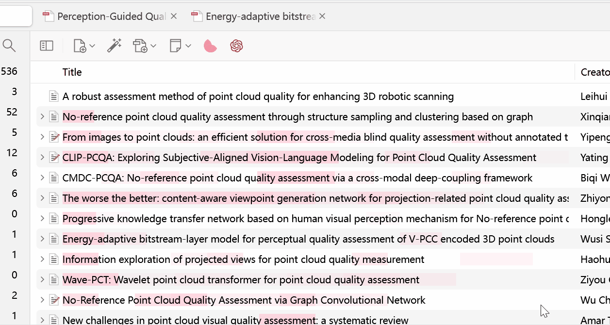
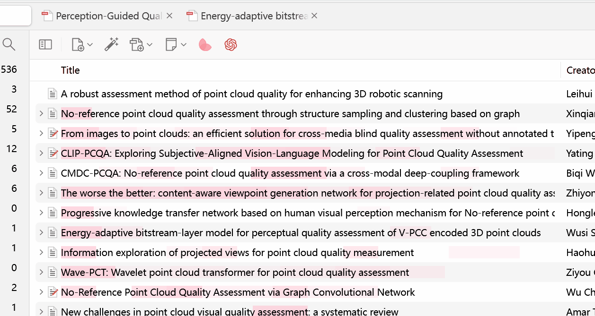

# Tab Enhance for Zotero

[简体中文](../README.md) | English

Tab Enhance is a Zotero 7 plugin that adds more convenient features to Zotero tabs.

## Main Features

- **Show in Filesystem**: Right-click on a document tab to quickly locate the current document in the filesystem (avoiding the two-step jump from Zotero item to filesystem)
- **Reload Tab**: Right-click on a document tab to reload the tab (convenient for synchronizing document modifications from external editors)
- _(More features in development...)_

## Installation

1. Download the latest `.xpi` file from the [Releases page](https://github.com/Rphone/zotero-tab-enhance/releases)
2. In Zotero, select `Tools -> Add-ons -> ⚙️ -> Install Add-on From File`, then select the downloaded XPI file

## Compatibility

- Requires Zotero 7.0 or higher
- Compatible with Zotero 7.0-7.1.*

## Features

### Show in Filesystem

1. Open a PDF or other document in Zotero
2. Right-click on the document's tab
3. Select "Show in Filesystem" option

   #### Feature Screenshot

### Tab Reload

1. Open a PDF or other document in Zotero
2. Right-click on the document's tab
3. Select "Reload" option

   #### Feature Screenshot

   

## Feedback

As I am not an experienced JavaScript and Zotero developer, the plugin may encounter potential bugs. If you have any issues or suggestions, please submit them on the [GitHub Issues](https://github.com/Rphone/zotero-tab-enhance/issues) page.

## License

This project is released under the [AGPLv3](https://www.gnu.org/licenses/agpl-3.0.html) license.
