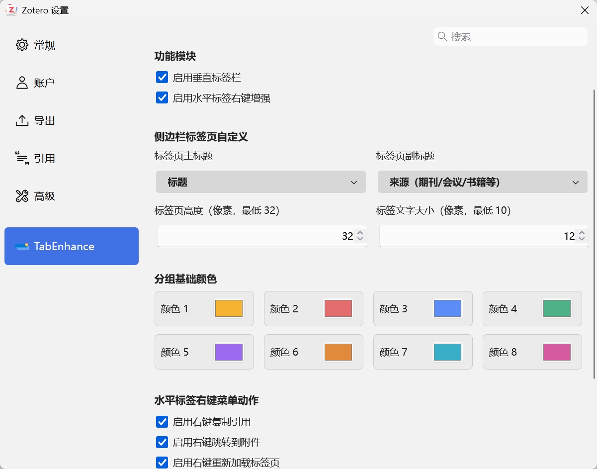
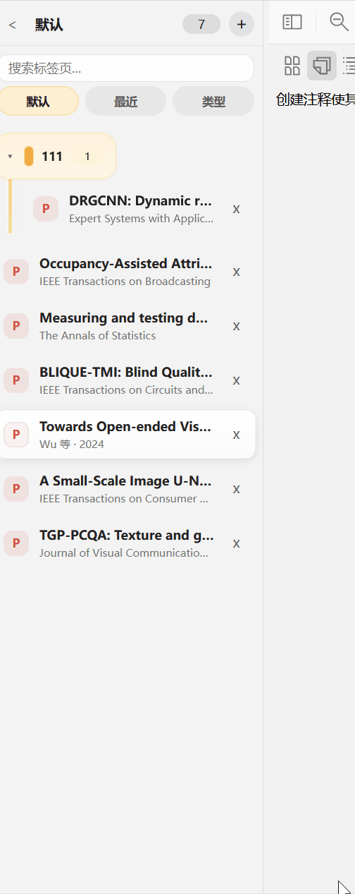
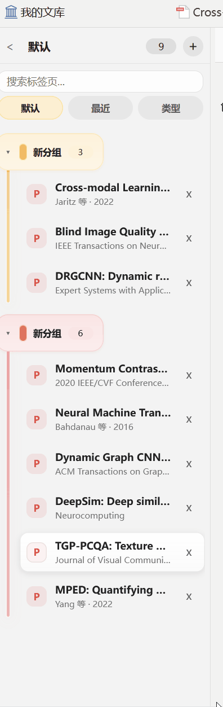
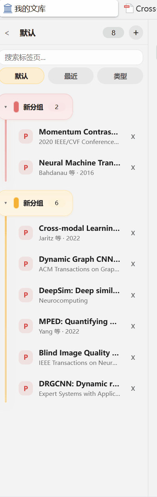
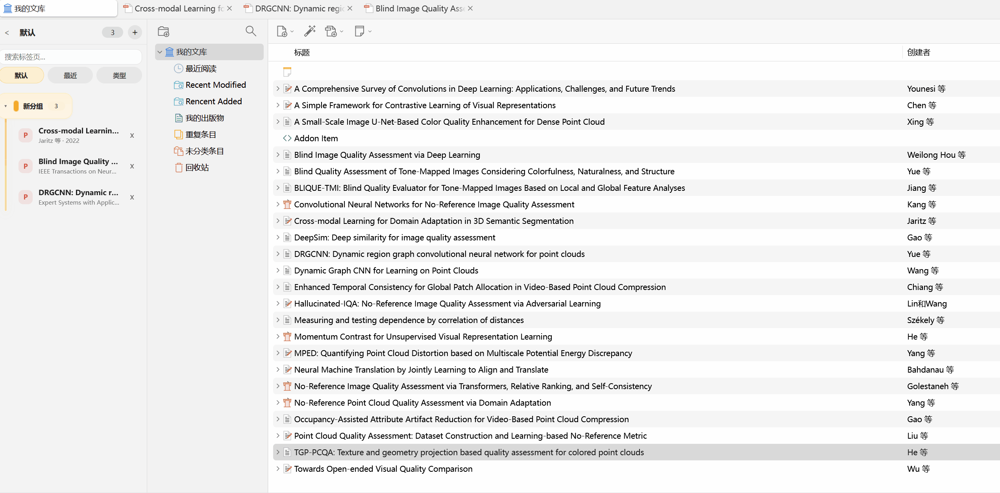

# Tab Enhance for Zotero

简体中文 | [English](doc/README_en.md)

Tab Enhance 是一个 Zotero 标签页增强插件。它提供可搜索、可分组、可排序的垂直标签页侧边栏，并扩展原生水平标签页和条目列表的右键菜单，帮助用户管理大量阅读器标签页。

## 功能概览

- **垂直标签页侧边栏**：同步 Zotero 原生标签页，可搜索、切换视图、调整宽度和快速收起。
- **持久化标签页分组**：支持创建、排序、重命名、换色、折叠、整组打开或关闭；组内标签关闭后仍可保留并恢复。
- **完整的拖拽管理**：调整原生标签顺序、组内成员顺序和分组顺序，也可在分组之间移动标签。
- **水平标签页右键增强**：在文件管理器中显示附件、重新加载阅读器、复制引用，以及创建或加入分组。
- **从条目列表打开并分组**：将一个或多个所选条目的最佳文件附件直接打开到新分组或已有分组。

## 安装与启用

1. 从 [Releases 页面](https://github.com/Rphone/zotero-tab-enhance/releases)下载最新的 `.xpi` 文件。
2. 在 Zotero 中打开 `工具 -> 插件`。
3. 点击右上角齿轮按钮，选择 `Install Plugin From File`，然后选择下载的 XPI 文件。
4. 打开 Zotero 设置中的 `TabEnhance` 页面，按需启用“垂直标签栏”和“水平标签右键增强”。

> 垂直标签栏和水平标签右键增强默认关闭，安装后需要在插件设置中启用。水平标签页中的分组入口依赖垂直标签栏。

## 垂直标签页侧边栏

启用后，插件会在 Zotero 内容区左侧添加标签页侧边栏，并自动同步当前窗口中的原生标签页。点击标签行可以切换标签页，点击关闭按钮可以关闭对应的原生标签页。

- 拖动分隔条调整侧边栏宽度。
- 点击标题栏左侧按钮收起或展开侧边栏。
- 使用 `Ctrl+B` 快速切换侧边栏；macOS 可使用 `Cmd+B`。
- 自动适配 Zotero 的浅色和深色主题。
- 侧边栏标题旁显示当前标签页数量。

### 搜索与视图切换

搜索框可按分组名称、标签标题及标签信息过滤当前内容。侧边栏提供三种视图：

- **默认**：显示分组和未分组标签，并提供完整的分组与拖拽操作。
- **最近**：按“刚刚”“今天”“更早”聚合当前打开的标签页。
- **类型**：按阅读器、笔记、网页及其他类型聚合当前打开的标签页。

## 标签页分组

### 创建和添加标签

可以通过多种入口建立分组：

- 点击侧边栏标题栏的 `+`，将当前所有未分组且已打开的标签页放入一个新分组。
- 右键单个标签页并选择“新建分组”，以该标签页创建分组。
- 右键标签页并选择“添加到分组”，将其加入已有分组。
- 在 Zotero 条目列表中使用“打开并分组”，将所选条目的文件附件打开到新分组或已有分组。

创建或重命名分组时可直接在侧边栏中编辑名称，按 `Enter` 确认，按 `Esc` 取消。

### 分组管理

右键分组标题可以：

- 打开组内全部标签。
- 关闭其他标签并打开本组。
- 关闭组内所有已打开标签。
- 展开或折叠分组。
- 重命名分组。
- 从预设颜色中更改分组颜色。
- 解散分组，但不关闭仍处于打开状态的标签页。

分组中的阅读器标签关闭后不会从分组删除，而是显示为关闭状态。点击该成员或选择“加载标签页”即可重新打开；也可以通过分组菜单批量恢复。

### 拖拽排序

在默认视图中可以直接拖拽：

- 调整未分组标签的顺序，并同步到 Zotero 原生水平标签页。
- 调整组内成员顺序。
- 将未分组标签拖入分组。
- 将成员移动到其他分组，或将已打开成员拖回未分组列表。
- 调整分组之间的顺序。

也可以通过组内成员右键菜单选择“移动到分组”“添加到分组”或“从分组移除”。“添加到分组”会保留原分组中的成员，“移动到分组”则会从原分组移除。

## 水平标签页右键增强

启用“水平标签右键增强”后，右键 Zotero 原生阅读器标签页可使用以下操作。各附件操作可以在插件设置中独立开关。

### 在文件管理器中显示

直接定位当前阅读器对应的本地附件，省去从标签页返回条目再打开附件位置的步骤。

### 重新加载标签页

关闭并重新打开当前阅读器标签页，用于刷新外部编辑器对 PDF 或其他附件所做的修改。

### 复制引用

将当前文献的引用复制到剪贴板。输出格式遵循 Zotero 的快速复制设置，可在 `编辑 -> 设置 -> 导出 -> 快速复制` 中配置。

### 分组操作

当垂直标签栏同时启用时，原生水平标签页右键菜单还会提供“新建分组”和“添加到分组”。

## 从条目列表打开并分组

启用垂直标签栏后，在 Zotero 条目列表中选择一个或多个条目并打开右键菜单，可以使用“打开并分组”：

1. 选择“打开到新分组”，为可打开的文件附件创建新分组。
2. 或选择一个已有分组，将附件打开并加入该分组。
3. 多选时，插件会在后台依次打开每个条目的最佳文件附件，并避免重复打开同一附件。

没有可用文件附件的条目会被跳过。

## 个性化设置

在 Zotero 设置的 `TabEnhance` 页面中可以配置：

- 是否启用垂直标签栏和水平标签右键增强。
- 是否显示复制引用、跳转附件和重新加载操作。
- 主标题显示完整标题或短标题。
- 副标题显示来源、作者与年份、类型与条目编号，或完全隐藏。
- 标签页行高和文字大小。
- 8 个分组基础颜色；新分组会依次使用这些颜色，也可在分组菜单中重新选择。
- 一键清除插件偏好、侧边栏状态和分组数据，恢复初始化状态。

## 兼容性

- 兼容 Zotero 7-10。
- 支持 Windows、macOS 和 Linux；“在文件管理器中显示”的名称及行为由操作系统决定。

## 参与开发

欢迎提交 Issue 和 Pull Request。项目包含 [AGENTS.md](AGENTS.md)，其中说明了模块职责、开发约束和主要数据流，可用于快速了解代码结构。

## 感谢与反馈

感谢 [Zotero Plugin Template](https://github.com/windingwind/zotero-plugin-template) 提供插件开发模板。

感谢 [Ethereal Style](https://github.com/MuiseDestiny/zotero-style) 以及相关 [bilibili 视频](https://www.bilibili.com/video/BV1rwcBzbEVG/) 对侧边栏实现思路的讲解和展示。

Microsoft Edge 的标签页分组功能为本插件的分组交互和视觉设计提供了参考。

本项目的代码在 AI 协助下编写和优化，仍可能存在问题。使用中遇到错误或有改进建议时，请提交 [Issue](https://github.com/Rphone/zotero-tab-enhance/issues)。

## 许可

该项目基于 [AGPLv3](https://www.gnu.org/licenses/agpl-3.0.html) 许可发布。
